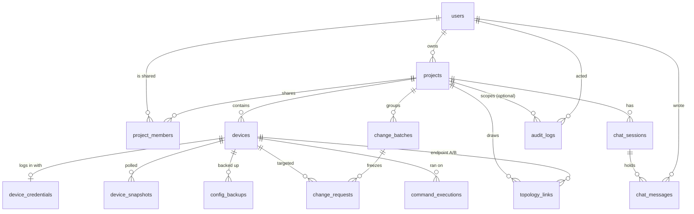

# Database design

SQLite through SQLAlchemy; every change goes through an Alembic migration in
`backend/migrations/versions/`. `flask db check` must report no drift between the
models and the migrations.

## Entity relationships

## Ownership: everything hangs off a project

| Table | Belongs to | When the parent is deleted |
|---|---|---|
| `devices`, `topology_links`, `chat_sessions`, `change_batches`, `project_members` | `projects` | deleted (CASCADE) |
| `device_credentials`, `device_snapshots`, `config_backups`, `change_requests` | `devices` | deleted (CASCADE) |
| `chat_messages` | `chat_sessions` | deleted (CASCADE) |
| `change_requests` | `change_batches` (optional) | deleted (CASCADE) |
| `audit_logs.project_id/device_id/user_id`, `command_executions.device_id/user_id`, `chat_messages.user_id`, `change_*.requested_by_id/approved_by_id`, `projects.owner_id`, `users.created_by_id` | the referenced row | set to NULL, so history survives |

History is never deleted because a person or device went away: those rows keep
their data and lose only the pointer. `audit_logs.username` and
`chat_messages.username` are deliberate snapshots for exactly that reason, and
`change_requests.target_*` freezes the identity of the device a change was
approved for.

## Integrity enforced by the database

* **Foreign keys are enforced** (`PRAGMA foreign_keys=ON` on every SQLite
  connection, `SQLITE_FOREIGN_KEYS`, default on). Without it SQLite silently
  ignores `ON DELETE` rules and accepts dangling ids. Migrations switch it off
  while a table is rebuilt (SQLite alters tables by copying them) and report any
  violation at the end.
* **CHECK constraints** on every enumerated column (`users.role`, `devices.role /
  device_type / status / environment`, `ssh_port` range, `projects.environment`,
  `project_members.access`, `topology_links.link_type`, change/batch `status`,
  `risk_level`, `source`, `execution_mode`, `audit_logs.result`,
  `command_executions.status`, `device_snapshots.status`, `chat_messages.role`).
  The application validates first; the constraint is the backstop.
* **Uniqueness**
  * `users.username`, `users.email` (optional, so several NULLs are fine)
  * `devices (project_id, hostname)` and `(project_id, management_ip)` — unique
    per project, not globally
  * `projects (owner_id, name)`, `project_members (project_id, user_id)`
  * `topology_links (device_a_id, interface_a)` and `(device_b_id, interface_b)`:
    one cable per interface; and `device_a_id <> device_b_id`
* **Constraint names follow one convention** (`pk_`, `fk_`, `uq_`, `ck_`, `ix_`
  prefixes, see `extensions.NAMING_CONVENTION`) so a migration can address them.

## Indexes

Single-column indexes exist on every foreign key and on `created_at`. Composite
indexes serve the list queries the UI runs:

| Index | Query |
|---|---|
| `change_requests (device_id, status)` | changes of a device by state |
| `audit_logs (project_id, created_at)` | a project's audit trail, newest first |
| `command_executions (device_id, created_at)` | command history of a device |
| `device_snapshots (device_id, created_at)` | latest snapshot of a device |
| `config_backups (device_id, created_at)` | backups of a device |
| `chat_messages (session_id, created_at)` | a transcript in order |

## Accounts

`users` carries `role` (`ADMIN` / `OPERATOR` / `VIEWER`), `is_active`,
`full_name`, `email`, `last_login_at`, `password_changed_at`, `created_by_id`
and `token_version`. Every JWT embeds the `token_version` it was issued with;
changing a password, role or active flag bumps it, which revokes all earlier
tokens at once. The role used for authorisation is read from this table, never
from the token.

## Known limits

* `config_backups.change_request_id` is a plain integer: `change_requests` and
  `config_backups` reference each other, and a hard FK in both directions
  cannot be created or deleted without deferring constraints.
* `change_requests` has no `project_id` of its own; its project is its device's.
  `change_batches.project_id` exists because a batch may outlive a device.
* SQLite is the only supported backend (see `config.py`).
